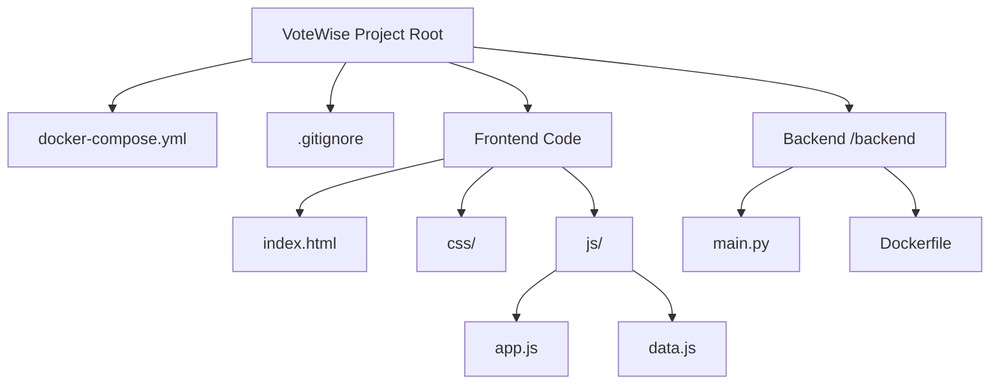
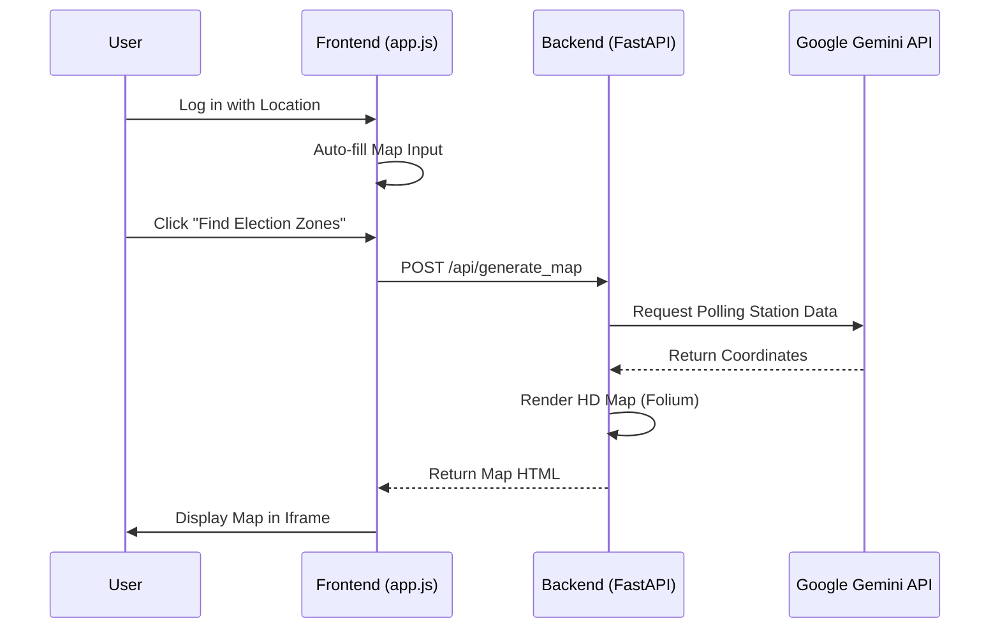

# VoteWise — Your Personal Election Assistant

Welcome to **VoteWise**, an AI-powered Progressive Web App (PWA) designed to simplify the electoral process, educate voters, and drive civic engagement using modern web technologies and advanced AI.

---

## Key Features

VoteWise provides an immersive, end-to-end election experience:

*   **Interactive Election Timeline:** Track milestones, registration deadlines, and countdowns for elections globally.
*   **Step-by-Step Voting Wizard:** A personalized guide walking users through the voting process based on their region (India, US, UK, EU) and preferred method (In-Person or Mail-In).
*   **AI Chat Assistant:** A smart conversational bot to instantly answer any election-related queries (registration, documents, polling methods).
*   **Knowledge Quiz & Dashboard:** Gamified learning with adaptive quizzes and a user dashboard that tracks "Election Readiness", badges, and live progress.
*   **Live Polling Booths (Crowd Monitor):** Real-time, color-coded indicators simulating crowd levels and wait times at nearby voting centers.
*   **Metaverse Election Museum:** An immersive digital gallery exploring the history of democracy (e.g., The First Vote, Evolution of EVMs).
*   **Live Events Feed:** Track local cultural performances, panel discussions, and street plays designed to boost voter awareness.
*   **Civic Pride Digital Ink:** A gamified, interactive button that awards users a digital "I Voted" badge (indelible ink mark) with a celebratory confetti animation.
*   **Interactive HD Maps:** Dynamic satellite maps showing exactly where nearby polling booths are located.

---

## Google Technologies & Services Integration

VoteWise is heavily architected around Google's ecosystem to provide a fast, smart, and scalable user experience:

### 1. Google Gemini AI (Core Intelligence)
The heart of VoteWise's dynamic features is powered by the **Gemini 1.5 Flash API**:
*   **Dynamic Map Generation (`backend/main.py`):** The Python backend uses the Gemini API to analyze the user's location (e.g., "Hubli") and dynamically generate JSON coordinates for realistic, highly accurate nearby polling stations (schools, municipal buildings). These coordinates are then rendered onto an HD Satellite Map using Folium.
*   **AI Assistant:** Designed to utilize Gemini for advanced Retrieval-Augmented Generation (RAG) to parse complex electoral laws and provide instant, conversational answers to voters.

### 2. Google Typography & Aesthetics
*   The entire UI is built leveraging **Google Fonts** (`Inter` and `Google Sans`) to provide a premium, readable, and highly accessible user interface that mimics the clean aesthetics of Material Design 3.

### 3. Google Cloud Platform (Deployment Roadmap)
*   **Firebase / Firestore:** The architecture is designed to scale with Firebase for real-time crowd data syncing and user authentication.
*   **Cloud Run:** The Dockerized Python backend and Vite frontend are structured specifically for containerized deployment on Google Cloud Run.

---

## Tech Stack & Code Structure

The project uses a decoupled frontend/backend architecture for maximum performance.

### Frontend (PWA)
*   **Build Tool:** Vite (`npm run dev` / `npm run build`)
*   **Core:** HTML5, Vanilla CSS3 (with extensive CSS Variables for Light/Dark mode), Vanilla JavaScript (ES Modules).
*   **Icons:** Lucide SVGs (dynamically rendered via DOM observers for performance).
*   **Key Files:**
    *   `index.html`: The main Single Page Application structure.
    *   `js/app.js`: Core routing, state management, UI rendering logic, and API calls.
    *   `js/data.js`: Mock data structures for election timelines, FAQs, and events.
    *   `css/components.css`: Premium glassmorphism styles and UI components.

### Backend (Map Generation API)
*   **Framework:** FastAPI (Python)
*   **Libraries:** `google-generativeai`, `folium` (for map rendering), `uvicorn`.
*   **Key Files:**
    *   `backend/main.py`: The server exposing the `/api/generate_map` endpoint. It prompts Gemini for coordinates and generates the Folium HD HTML map.

### Deployment Operations
*   **Docker:** A multi-stage `Dockerfile` is included to compile the Vite frontend using Node.js and serve it ultra-fast using an Nginx alpine image.

---

## How to Run Locally

To experience VoteWise with full functionality:

**1. Start the Python Backend**
```bash
cd backend
pip install -r requirements.txt
python main.py
```
*(The FastAPI server will start on http://localhost:8000)*

**2. Start the Frontend Application**
Open a new terminal in the root directory:
```bash
npm install
npm run dev
```
*(Vite will launch the application on http://localhost:5173)*

Navigate to the **Live Booths** section in the app, type in your native city, and watch the Gemini API instantly generate a custom HD map for you!

---

## Architecture & Flow

### File Structure



### Application Flow


