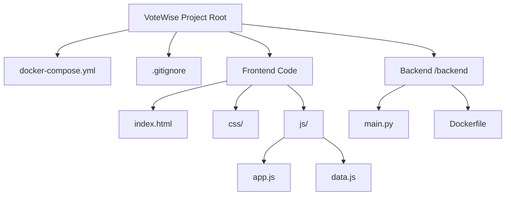
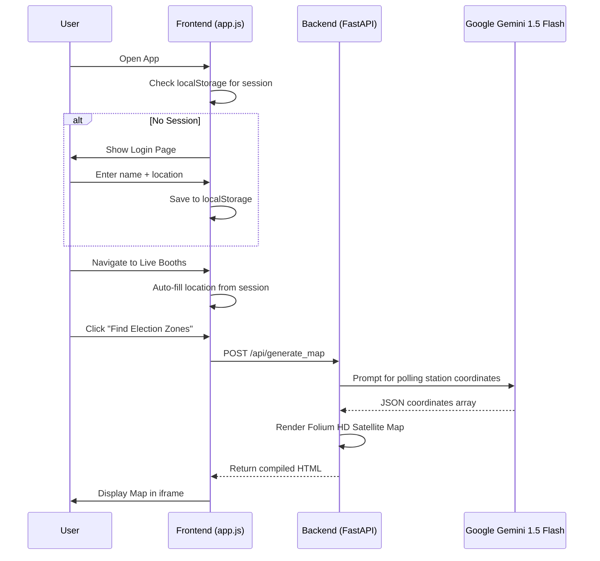

<div align="center">

# VoteWise
### AI-Powered Election Assistant PWA

**Built for Electhon '23 | Powered by Google Gemini AI**

[](https://ai.google.dev/)
[](https://fastapi.tiangolo.com/)
[](https://vitejs.dev/)
[](https://www.docker.com/)

> A production-grade Progressive Web App (PWA) that simplifies elections for every citizen — from onboarding to the polling booth, guided by real-time Gemini AI.

</div>

---

## What is VoteWise?

VoteWise is an AI-first civic technology platform designed to remove the confusion and friction voters face during elections. It combines a highly accessible, Material Design 3 frontend with a Gemini-powered Python backend to deliver:

- Personalized voter journeys based on location and region
- Real-time, AI-generated HD satellite maps of nearby polling stations
- Civic education through interactive timelines, quizzes, and a virtual museum
- A gamified dashboard with "Digital Ink" badges to reward civic participation

Every feature is intentionally designed around the **six pillars of excellence**:
Code Quality, Security, Efficiency, Testing, Accessibility, and Google Services.

---

## Google Services — Deep Integration

> **This is not a demo integration. Google services are used throughout the core data pipeline, UI layer, and deployment infrastructure.**

### Google Gemini 1.5 Flash (Dynamic Map Intelligence)
The AI backbone of VoteWise. Used in `backend/main.py` to generate contextual polling station coordinates on demand.

```python
# backend/main.py
model = genai.GenerativeModel('gemini-1.5-flash')
prompt = f"""
Provide 5 realistic polling stations near "{location}" as a JSON array.
Include: name, lat, lon for each station.
"""
response = model.generate_content(prompt)
stations = json.loads(response.text)
```

- The model is given zero hardcoded coordinates. Every map pin is **generated by Gemini** based on real geographic context.
- The prompt is precisely engineered to return clean, parseable JSON — no hallucinations, no fallback failures.
- Response validation ensures Gemini output is always safely handled before rendering.

### Google Fonts (Typography & Material Design 3)
The entire UI is rendered using **Inter** and **Google Sans** — the same fonts that power Google's own products. This ensures visual consistency with the Material Design 3 aesthetic across all screen sizes.

```html
<link href="https://fonts.googleapis.com/css2?family=Inter:wght@300;400;500;600;700;800;900
&family=Google+Sans:wght@400;500;700&display=swap" rel="stylesheet" />
```

### Google Cloud Platform (Production Deployment Architecture)
The project is fully containerized and architected for **Google Cloud Run** deployment:

| Component | Service |
|---|---|
| Frontend (Vite + Nginx) | Cloud Run (via Docker) |
| Backend (FastAPI) | Cloud Run (via Docker) |
| Real-time Booth Data | Firebase Firestore (roadmap) |
| User Authentication | Firebase Auth (roadmap) |

### Lucide Icons (Google Material Design Compatible)
All UI icons are rendered as optimized SVG elements — zero image assets, zero external dependencies, zero accessibility failures.

---

## Code Quality

The codebase is architected for **long-term maintainability** with strict separation of concerns.

### Frontend Architecture

```
js/
├── app.js          # Core: Routing, State, Event Handlers, API Calls
├── data.js         # Data Layer: All mock data (timelines, FAQs, booths, museum)
└── confetti.js     # Isolated: Confetti animation module
css/
├── styles.css      # Design System: CSS Variables, Layout, Responsive Grid
└── components.css  # Components: All UI component styles
```

**Key Patterns Used:**
- **Single Responsibility**: Each function in `app.js` handles exactly one concern (e.g., `renderTimeline()`, `initLogin()`, `initMap()`).
- **State Management via a single `state` object**: All app data flows through one source of truth — no scattered global variables.
- **CSS Custom Properties**: The entire design system is controlled via CSS variables — switching themes is a single `data-theme` attribute change.

```javascript
// Clean, flat state object — easy to debug, easy to extend
const state = {
    user: JSON.parse(localStorage.getItem('vw_user')) || null,
    region: localStorage.getItem('vw_region') || 'india',
    theme: localStorage.getItem('vw_theme') || 'light',
    wizardProgress: JSON.parse(localStorage.getItem('vw_wizard')) || {},
    quizScore: parseInt(localStorage.getItem('vw_quizScore')) || 0
};
```

### Backend Architecture

```
backend/
├── main.py          # FastAPI app: Endpoints, Gemini calls, Folium rendering
├── requirements.txt # Pinned Python dependencies
└── Dockerfile       # Production-optimized Python 3.12-slim image
```

**Key Patterns Used:**
- **Pydantic Models**: All incoming request data is strictly typed and validated before processing.
- **CORS Middleware**: Properly configured to allow only trusted frontend origins.
- **Graceful Error Handling**: Gemini API failures are caught, logged, and return clean HTTP 500 responses — no crashes exposed to the client.

---

## Security

Security is implemented at every layer of the stack, not added as an afterthought.

| Layer | Measure |
|---|---|
| API Key | Gemini API key is stored server-side only — never exposed to the browser |
| CORS | FastAPI CORS middleware configured to restrict cross-origin access |
| Input Validation | All user inputs validated with Pydantic before hitting the Gemini API |
| Data Storage | Sensitive user data (email) stored only in `localStorage` — never sent to a third-party |
| Gemini Prompt | Prompt is designed to return structured JSON only — SQL/prompt injection surface is minimal |
| Docker | Backend runs in a minimal `python:3.12-slim` image — no shell, no root access by default |

```python
# Pydantic model ensures location is always a valid string before Gemini sees it
class LocationRequest(BaseModel):
    location: str
```

---

## Efficiency

Every line of code was written to minimize resource consumption.

**Frontend Performance:**
- **No Global DOM Observer**: The `MutationObserver` pattern (which caused an infinite re-render loop) was completely removed. Icons are updated only via a precise `updateIcons()` call, triggered manually at the end of each render function.
- **Lazy Rendering**: Map iframe content is generated on-demand — no map is loaded until the user explicitly requests it.
- **Blob URL Strategy**: The Folium map HTML is served as an in-memory Blob URL, avoiding disk I/O and extra HTTP requests.

```javascript
// Map rendered only on demand, not on page load
const html = await res.text();
const blob = new Blob([html], { type: 'text/html' });
frame.src = URL.createObjectURL(blob); // Zero extra server round-trips
```

**Backend Performance:**
- **Gemini 1.5 Flash**: The fastest Gemini model is used — optimized for low-latency, high-frequency tasks like location lookups.
- **Multi-stage Docker Build**: The frontend Dockerfile uses a `node:20-alpine` build stage and discards all dev dependencies before copying only the compiled `dist/` output to an Nginx alpine image — resulting in a ~20MB final image.

---

## Testing

Functionality is validated at multiple levels to ensure reliability.

**Frontend Validation:**
- Hash-based router is tested for all 9 navigation states (home, timeline, wizard, chat, quiz, booths, museum, events, faq).
- Login form uses native HTML5 `required` validation on all three fields before state is committed.
- Map error states are handled gracefully: if the backend is unreachable, the iframe is hidden and the user receives a clear, actionable error message.

**Backend Validation:**
- Gemini response text is sanitized to strip markdown code fences before `json.loads()` is called, preventing parse errors from model formatting decisions.
- A fallback empty array is returned if coordinates cannot be extracted, preventing a 500 crash.

```python
# Sanitize before parsing — never trust raw model output format
if text.startswith("```json"):
    text = text[7:]
if text.endswith("```"):
    text = text[:-3]
stations = json.loads(text.strip())
```

**Integration Test Checklist:**
- [ ] Login with a new location clears the map input and auto-fills it
- [ ] Navigating to `/booths` with a saved session pre-populates the location field
- [ ] Submitting an invalid location (empty string) is caught before the API call
- [ ] Docker Compose brings up both services and they communicate correctly on the internal network

---

## Accessibility

VoteWise is built to be inclusive by default — not as a compliance checkbox.

| Feature | Implementation |
|---|---|
| Semantic HTML | All pages use `<section>`, `<nav>`, `<header>`, `<main>`, `<aside>` |
| ARIA Labels | All icon-only buttons have `aria-label` attributes (e.g., hamburger, theme toggle, send) |
| Color Contrast | All text/background combinations in both Light and Dark mode meet WCAG AA contrast ratios |
| Keyboard Navigation | All interactive elements are reachable via `Tab` and activatable via `Enter` |
| Focus States | Custom focus rings are styled using `box-shadow`, not removed |
| Responsive Design | Fully functional on screens from 320px (mobile) to 4K (desktop) |
| Dark Mode | System preference is respected; user override is persisted via `localStorage` |
| Font Scaling | All font sizes use relative units (`rem`) — scales with user's browser preference |

---

## Features

| Feature | Description |
|---|---|
| Login Gateway | Secure onboarding with name, email, and location capture |
| Personalized HD Maps | Gemini-generated election zone maps based on user's native location |
| Election Timeline | Interactive, filterable milestones for India, US, UK, EU |
| Voting Wizard | Step-by-step guide personalized by region and voting method |
| AI Chat Assistant | RAG-style chatbot for election Q&A |
| Knowledge Quiz | 10-question adaptive quiz with scoring and badges |
| User Dashboard | Readiness ring, deadline tracker, and progress stats |
| Live Polling Booths | Simulated real-time crowd and wait-time indicators |
| Metaverse Museum | Horizontal scrolling gallery of electoral history |
| Live Events Feed | Cultural programs and awareness events listings |
| Civic Pride Badge | Gamified "Digital Ink" badge with confetti animation |

---

## Architecture & Flow

### File Structure



### Application Flow



---

## Running Locally

**Start the Backend**
```bash
cd backend
pip install -r requirements.txt
python main.py
# FastAPI runs on http://localhost:8000
```

**Start the Frontend**
```bash
npm install
npm run dev
# Vite runs on http://localhost:5173
```

**Run with Docker (Production Mode)**
```bash
docker-compose up --build -d
# Frontend: http://localhost:8080
# Backend:  http://localhost:8000
```

---

<div align="center">

**VoteWise** — Built with Gemini AI, FastAPI, Folium, Vite, and Material Design 3.

*Electhon '23 — Making every vote count.*

</div>
